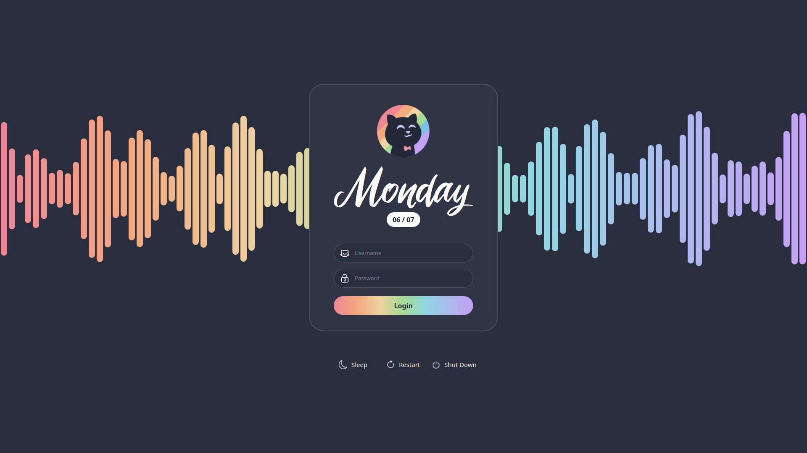

Catlogin

A clean, Catppuccin-inspired SDDM login theme built with QML for Plasma 6 / Qt6.




## Credit

The weekday + date display design is **heavily inspired by zayronoxi's "Urban Date" 0.6 KDE Plasma widget**.
No code was copy-pasted from that widget — this is an original QML implementation built from scratch for SDDM — but visually the 
layout is very close to theirs, minus the proprietary font it originally shipped with (swapped here for a freely distributable alternative).
Full credit to zayronoxi for the original design concept.

```bash
sudo cp -r Catlogin /usr/share/sddm/themes/catlogin
```

Set it as the active theme in `/etc/sddm.conf.d/theme.conf`:

```ini
[Theme]
Current=catlogin
```

Then restart SDDM:

```bash
sudo systemctl restart sddm
```

## Testing without logging out

```bash
sddm-greeter-qt6 --test-mode --theme /usr/share/sddm/themes/catlogin
```

Note: `--test-mode` disables real login/suspend/reboot/shutdown actions — it's for visual testing only.

## Configuration

All colors, icons, fonts, and wave-animation parameters live in `theme.conf`. To customize without losing your changes on theme updates, 
create a `theme.conf.user` file in the same directory with just the values you want to override.

## License

Feel free to fork, modify, and re-theme. If you build something cool with it, a shoutout is appreciated but not required.
